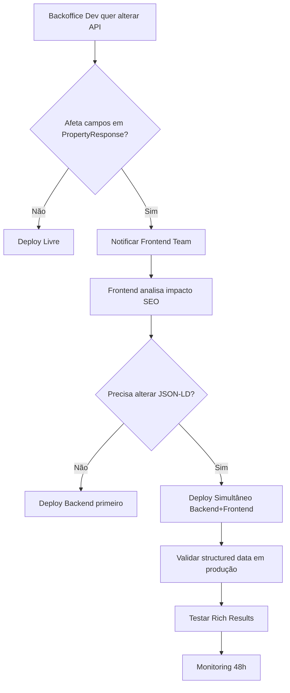

# 🎯 Diretrizes para Dev Team Backoffice - Manutenção SEO Site Montra

**Data**: 16 de dezembro de 2025  
**Versão**: 1.0  
**Scope**: Sincronização de dados Backoffice ↔ API ↔ Site Montra (Frontend Web)

---

## 📌 Contexto

O **site montra** (frontend web) consome dados da **API FastAPI** (`https://crm-plus-production.up.railway.app`) para exibir propriedades com **structured data JSON-LD** otimizado para SEO.

Qualquer alteração nos **modelos de dados**, **campos da API** ou **status de propriedades** pode **quebrar o SEO** e os **rich snippets** no Google.

---

## 🔗 Arquitetura de Dados (Backend → API → Frontend)

```
┌─────────────────┐       ┌──────────────┐       ┌─────────────────┐
│   BACKOFFICE    │ ────> │   FastAPI    │ ────> │  SITE MONTRA    │
│  (Admin Panel)  │       │   Backend    │       │ (Frontend Web)  │
│                 │       │              │       │                 │
│ - Criar/editar  │       │ Endpoints:   │       │ Consome:        │
│   propriedades  │       │ /properties/ │       │ - /properties/  │
│ - Upload fotos  │       │ /gallery/    │       │ - /gallery/     │
│ - Alterar status│       │              │       │                 │
└─────────────────┘       └──────────────┘       └─────────────────┘
                                                   │
                                                   ├─> JSON-LD Schema
                                                   ├─> Open Graph
                                                   └─> Google Indexation
```

---

## ⚠️ Campos Críticos para SEO (NUNCA ALTERAR SEM VALIDAÇÃO)

### 1. **Property Model** (`backend/app/models/Property`)

| Campo | Uso no SEO | Impacto se Alterado | Schema.org Type |
|-------|-----------|---------------------|-----------------|
| `reference` | URL slug (`/imovel/{reference}`) | 🔴 **CRÍTICO** - quebra URLs indexados | `@id` |
| `title` | JSON-LD `name`, `<title>`, OG:title | 🟡 **ALTO** - afeta snippets | `name` |
| `description` | JSON-LD `description`, meta description | 🟡 **ALTO** - afeta snippets | `description` |
| `price` | JSON-LD `offers.price` | 🟡 **ALTO** - rich snippets preço | `Offer.price` |
| `status` | JSON-LD `offers.availability` | 🟢 **MÉDIO** - afeta disponibilidade | `Offer.availability` |
| `municipality` | JSON-LD `address.addressLocality` | 🟢 **MÉDIO** - localização | `PostalAddress.addressLocality` |
| `parish` | JSON-LD `address.addressRegion` | 🟢 **MÉDIO** - região | `PostalAddress.addressRegion` |
| `property_type` | JSON-LD `name`, breadcrumbs | 🟡 **ALTO** - categorização | `Product.category` |
| `business_type` | JSON-LD `@type` (Product vs RentAction) | 🔴 **CRÍTICO** - tipo de schema | `@type` |
| `area` / `usable_area` | JSON-LD `floorSize.value` | 🟢 **MÉDIO** - especificações | `QuantitativeValue.value` |
| `bedrooms` | JSON-LD `numberOfRooms` | 🟢 **MÉDIO** - especificações | `numberOfRooms` |
| `bathrooms` | JSON-LD `numberOfBathroomsTotal` | 🟢 **MÉDIO** - especificações | `numberOfBathroomsTotal` |
| `created_at` | Sitemap `<lastmod>` | 🟢 **BAIXO** - freshness signal | N/A |

### 2. **Gallery Model** (`backend/app/models/Gallery`)

| Campo | Uso no SEO | Impacto se Alterado |
|-------|-----------|---------------------|
| `image_url` | JSON-LD `image[]`, OG:image | 🟡 **ALTO** - imagens rich snippets |

### 3. **Status Enum** (valores permitidos)

**Valores atuais**:
- `AVAILABLE` → `https://schema.org/InStock`
- `RESERVED` → `https://schema.org/PreOrder`
- `SOLD` → `https://schema.org/OutOfStock`

⚠️ **Se adicionar novos status, DEVE mapear para schema.org equivalente**

---

## 🛠️ Checklist: Quando Alterar Modelos/API

### ✅ Antes de Qualquer Alteração

1. **Notificar dev team frontend** com 48h de antecedência
2. **Documentar** alterações no contrato da API (`docs/api-contract.md`)
3. **Testar** endpoint com dados reais antes de deploy

### 📝 Alterações Permitidas SEM Impacto SEO

- ✅ Adicionar campos **opcionais** novos (não afeta JSON-LD existente)
- ✅ Alterar campos **internos** não expostos na API pública (`/properties/`)
- ✅ Melhorar performance de queries (desde que output JSON seja idêntico)

### 🚨 Alterações que EXIGEM Validação Frontend

#### 1. **Renomear Campos na API Response**

**Exemplo Proibido**:
```python
# ❌ NUNCA FAZER ISTO SEM AVISAR FRONTEND
class PropertyResponse(BaseModel):
    county: str  # ← RENOMEADO de municipality
```

**Impacto**: Quebra `address.addressLocality` no JSON-LD → rich snippets desaparecem

**Solução**:
```python
# ✅ Manter retrocompatibilidade
class PropertyResponse(BaseModel):
    municipality: str  # Campo original (mantém)
    county: str = None  # Novo campo (adicional)
```

#### 2. **Alterar Valores de Enum (status, property_type, business_type)**

**Exemplo Problemático**:
```python
# ❌ CUIDADO: Alterar valores de status
class PropertyStatus(str, Enum):
    AVAILABLE = "disponivel"  # ← Era "AVAILABLE" (uppercase)
```

**Impacto**: Frontend espera `AVAILABLE` (uppercase) para mapear `InStock`

**Solução**:
1. Frontend dev team deve atualizar mapeamento em `app/imovel/[referencia]/page.tsx`:
   ```tsx
   // Atualizar mapeamento
   "availability": property.status?.toLowerCase() === "disponivel" 
     ? "https://schema.org/InStock" 
     : "https://schema.org/OutOfStock"
   ```
2. Deploy simultâneo backend + frontend

#### 3. **Alterar Estrutura de Imagens (Gallery)**

**Se mudar de**:
```json
["https://example.com/img1.jpg", "https://example.com/img2.jpg"]
```

**Para**:
```json
[{"url": "https://...", "caption": "..."}, ...]
```

**Ação Necessária**:
1. Frontend deve alterar linha 128 de `page.tsx`:
   ```tsx
   // DE:
   "image": images.length > 0 ? images : [],
   
   // PARA:
   "image": images.length > 0 ? images.map(img => img.url) : [],
   ```
2. Rebuild + redeploy frontend

#### 4. **Adicionar Novos Tipos de Propriedade**

**Exemplo**: Adicionar `"Garagem"` como novo `property_type`

**Ação Necessária**:
1. Verificar se breadcrumbs no frontend suportam nova categoria
2. Testar que JSON-LD `name` fica legível
3. (Opcional) Adicionar ícone customizado no frontend

---

## 🔄 Fluxo de Validação para Alterações



---

## 🧪 Testes Obrigatórios Após Alterações

### 1. **Validar API Response**
```bash
# Testar endpoint production
curl -s 'https://crm-plus-production.up.railway.app/properties/?limit=1' | python3 -m json.tool
```

**Verificar**:
- ✅ Campos esperados presentes (`reference`, `title`, `price`, `municipality`, etc.)
- ✅ Tipos corretos (strings, números, enums)
- ✅ Status em UPPERCASE (`AVAILABLE`, não `available`)

### 2. **Validar JSON-LD em Produção**
```bash
# Verificar structured data no site montra
curl -s 'https://web-k0x8jrf7q-toinos-projects.vercel.app/imovel/TV1270' | grep -o '<script type="application/ld+json">' | wc -l
```

**Esperado**: `2` (Product schema + BreadcrumbList schema)

### 3. **Rich Results Test** (Google)
```
URL: https://search.google.com/test/rich-results
Testar: https://web-k0x8jrf7q-toinos-projects.vercel.app/imovel/TV1270
```

**Verificar**:
- ✅ 0 erros detectados
- ✅ Product schema válido
- ✅ BreadcrumbList detectado

### 4. **Schema Validator**
```
URL: https://validator.schema.org/
Colar JSON-LD extraído da página
```

---

## 📊 Monitorização Contínua (Responsabilidade Backoffice Team)

### Semanal
- [ ] Verificar que todas as propriedades `AVAILABLE` estão visíveis na API
- [ ] Validar que uploads de imagens aparecem corretamente em `/gallery/{ref}`
- [ ] Testar que alterações de status no backoffice refletem na API (máx 5 min delay)

### Mensal
- [ ] Auditar propriedades sem imagens (`/properties/?has_images=false`)
- [ ] Verificar descrições vazias ou genéricas (prejudicam SEO)
- [ ] Validar que todos os campos obrigatórios estão preenchidos

### Quando Deploy Backend em Produção
1. ✅ Executar testes de smoke em `/properties/`, `/gallery/`
2. ✅ Notificar frontend team que deploy foi feito
3. ✅ Verificar logs Railway para erros 500/400 primeiros 30 min
4. ✅ Se mudou modelos, aguardar confirmação frontend que SEO está OK

---

## 🚨 Cenários de Emergência (Rollback Necessário)

### Sintoma: "Rich snippets desapareceram do Google"

**Causa Provável**: Alteração de campo na API quebrou JSON-LD

**Diagnóstico**:
```bash
# 1. Verificar structured data
curl -s 'https://web-k0x8jrf7q-toinos-projects.vercel.app/imovel/TV1270' | grep 'application/ld+json' -A 30

# 2. Testar com Rich Results
# Verificar erros de schema
```

**Solução**:
1. Rollback backend para versão anterior (Railway)
2. Notificar frontend team imediatamente
3. Analisar diff de código para identificar campo alterado
4. Corrigir + redeployar com testes

---

## 📚 Documentação de Referência

### Para Backoffice Developers
- **API Contract**: `docs/api-contract.md` (especificação endpoints)
- **Backend Endpoints**: `docs/backend-endpoints.md` (detalhes técnicos)
- **Database Schema**: `backend/db/schema.sql` (estrutura PostgreSQL)

### Para Frontend Developers (Site Montra)
- **Relatório SEO**: `RELATORIO_OTIMIZACOES_SEO_FINAL.md`
- **Guia Search Console**: `GUIA_GOOGLE_SEARCH_CONSOLE.md`
- **Código JSON-LD**: `frontend/web/app/imovel/[referencia]/page.tsx` (linhas 100-180)

### Schema.org References
- **Product**: https://schema.org/Product
- **RentAction**: https://schema.org/RentAction
- **Offer**: https://schema.org/Offer
- **PostalAddress**: https://schema.org/PostalAddress
- **BreadcrumbList**: https://schema.org/BreadcrumbList

---

## ✅ Checklist Final: Deploy Seguro

Antes de fazer deploy de alterações no backend:

- [ ] Li e entendi os campos críticos para SEO
- [ ] Testei endpoint localmente com dados reais
- [ ] Notifiquei frontend team (se alterou PropertyResponse)
- [ ] Atualizei `docs/api-contract.md` com mudanças
- [ ] Executei testes automatizados (`pytest`)
- [ ] Validei que status continua em UPPERCASE
- [ ] Confirmei que imagens retornam array de strings
- [ ] Agendei deploy em horário de baixo tráfego (00h-06h)
- [ ] Preparei plano de rollback se necessário

---

## 📞 Contatos

**Dúvidas sobre SEO/Frontend**:
- Verificar `RELATORIO_OTIMIZACOES_SEO_FINAL.md`
- Testar com Rich Results Test antes de contactar

**Dúvidas sobre API/Backend**:
- Consultar `docs/backend-endpoints.md`
- Verificar logs Railway: `railway logs --service backend`

**Emergências (SEO quebrado)**:
- Rollback imediato backend
- Notificar equipa frontend
- Executar diagnóstico com curl + Rich Results Test

---

**Última atualização**: 16 dezembro 2025  
**Versão**: 1.0  
**Próxima revisão**: Após cada alteração de schema no backend
