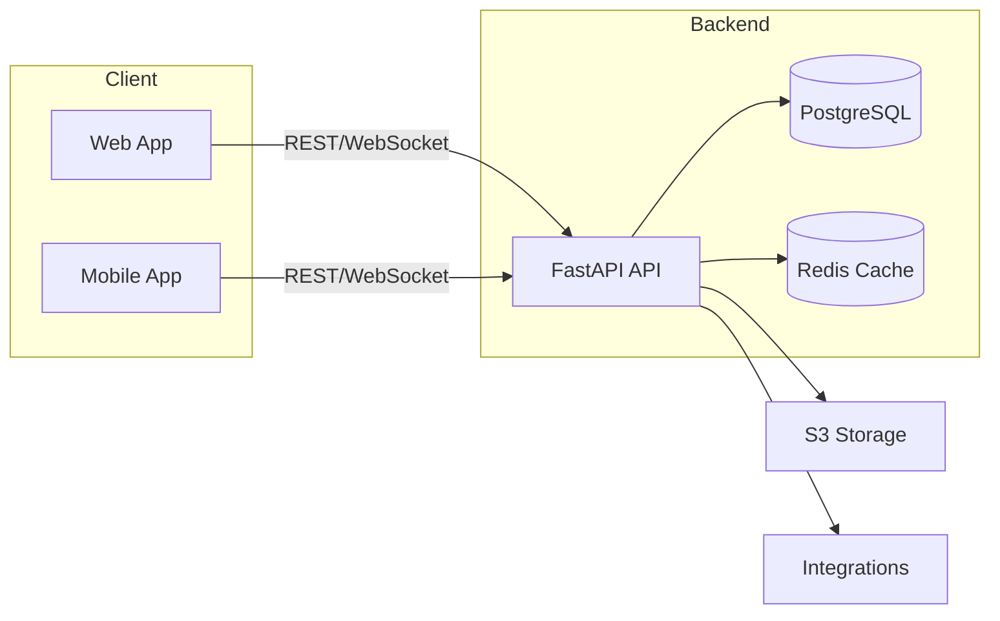

# CRM PLUS Architecture Overview

The platform follows an API-first approach. FastAPI exposes `/api/v1` endpoints secured with JWT. PostgreSQL stores authoritative data while Redis accelerates caching, rate limiting, and workflows.
